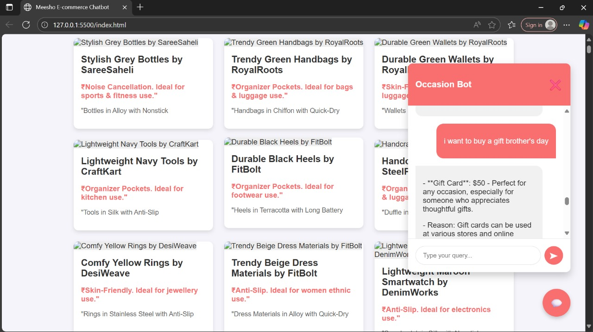

# Graph RAG based Ecommerce Agent

This project implements an intelligent, occasion-based e-commerce chatbot using a hybrid Graph and Vector Retrieval-Augmented Generation (RAG) system.

## Data Generation

```bash
python data_gen.py
```

## Setup Environment

1. Create .env file using .env_template
2. Create conda env

```
conda create --name grag python=3.10
conda activate grag
pip install -r requiremnts.txt
```

## Inference

**Run Backend Server**
Start the backend server, which will also create an ngrok tunnel for the API.

```bash
python infer.py
```

Copy the ngrok URL from the terminal output. You will need it for the frontend.

### 2. Frontend Setup

To run the chatbot interface:

1.  Open the `script.js` file.
2.  Find the `API_URL` constant and paste the ngrok URL you copied from the backend terminal.
3.  Open the `index.html` file directly in your web browser (e.g., Chrome, Firefox) or use a live server extension (like "Live Server" in VS Code) to serve the file.

The chatbot should now be visible and ready to take your queries.

## Demo

Here is a demonstration of the chatbot in action. The user asks for a "gift for brother's day," and the agentic system retrieves a relevant "Gift Card" recommendation, providing the price and a reason for the choice.


